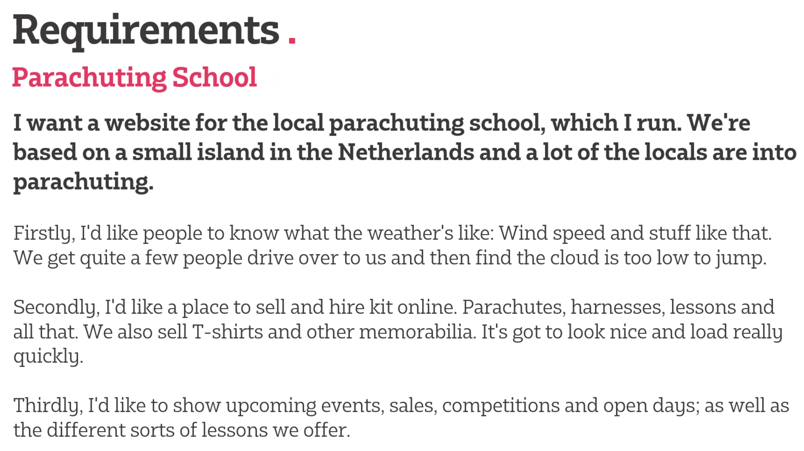

# Project Notes
## Schedule
- 10:15: Gather Requirements
- 10:30: Create User Stories, Add stories to project bord, give Acceptance Criteria & Definitions of Done
- 11:00: Development
- 12:00: Sales Talk
- 15:00: C# Development Presentation
- 16:30: Review - Present Work
- 17:00: Class Retrospective

## Details:

### Extras:
- Events page
  - Calendar
  - Filter by events, month etc.
- Twitter
  - ffdskfds
- Look nice and load quickly, just proof of concept
- Mobile Wireframe
- Login through facebook etc
- Home page shows events, past orders, shop for equipment
- Paypal, debit cards etc
- Registration page + adding new card page not required